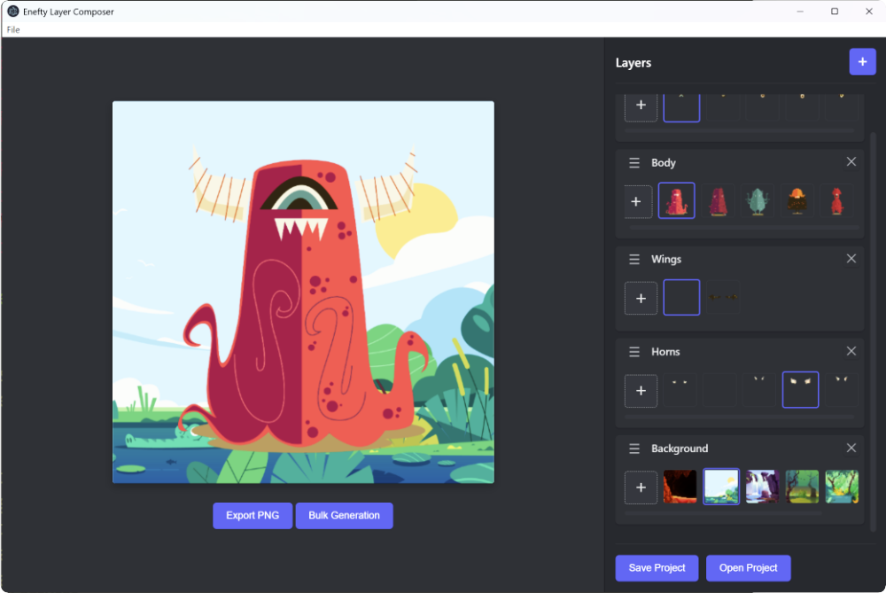

# Enefty Layer Composer

Enefty Layer Composer is a cross-platform desktop application for illustrators and creators to easily compose, preview, and export layered images. It is designed for generating multiple variations of artwork by combining different image layers, each with multiple options. The app is built with Electron and uses plain HTML, CSS, and JavaScript for its interface.

## Screenshot



## Example Use Cases

- **Digital Paper Doll for Kids:**
  Create a digital dress-up game by adding a base doll as the bottom layer and various clothing, hats, and accessories as additional layers. Kids can mix and match outfits and export their favorite looks.

- **Monster or Robot Creator:**
  Design a monster or robot by layering different heads, bodies, arms, legs, and accessories. Each layer can have multiple options, allowing users to create countless unique combinations.

- **NFT Graphics Generation:**
  Artists can prepare layers for backgrounds, characters, traits, and accessories, then use the bulk generation feature to automatically create all possible NFT image variations for a collection.

## Features
- Add, remove, rename, and reorder layers with drag-and-drop
- Add multiple PNG images to each layer
- Select the active image for each layer
- Live preview of the composed image
- Export the current preview as a PNG
- Save and load projects as `.enefty` files (JSON format)
- Bulk generation: automatically export all possible image variations based on layer/image combinations
- Cross-platform: works on Windows, macOS, and Linux

## Installation

1. **Install [Node.js](https://nodejs.org/)** (if you don't have it already).
2. Download or clone this repository to your computer.
3. Open a terminal/command prompt and navigate to the project directory:
   ```
   cd c:\laragon\www\enefty
   ```
4. Install dependencies:
   ```
   npm install
   ```
5. Start the application:
   ```
   npm start
   ```

## Getting Started

- **Add Layers:** Click the `+` button in the Layers panel to add a new layer.
- **Rename Layers:** Double-click a layer name to edit it. Press Enter to save.
- **Reorder Layers:** Drag layers using the handle (☰) to change their stacking order.
- **Add Images:** Click the `+` button on a layer to add PNG images. Each layer can have multiple images.
- **Select Images:** Click a thumbnail to set it as the active image for that layer.
- **Remove Images:** Click the `×` on a thumbnail to remove it from the layer.
- **Preview:** The left side shows the live composite of all selected images.
- **Export PNG:** Click `Export PNG` to save the current preview.
- **Save/Open Project:** Use the menu or buttons to save/load your project as a `.enefty` file.
- **Bulk Generation:** Click `Bulk Generation` to export all possible image combinations. Choose a destination folder and file prefix, then start the process.

## Notes
- All images in a project should have the same dimensions for correct composition.
- Bulk generation will overwrite files in the destination folder if names collide.

## License
MIT
